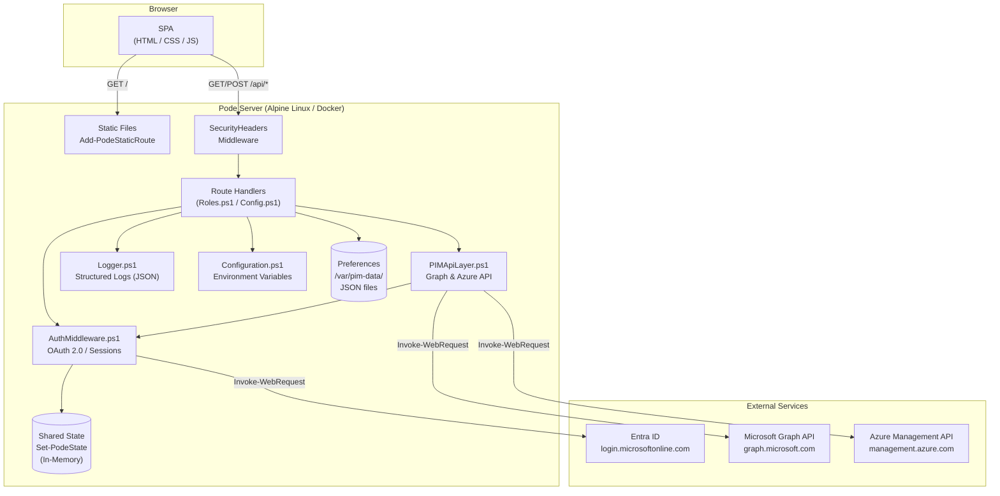
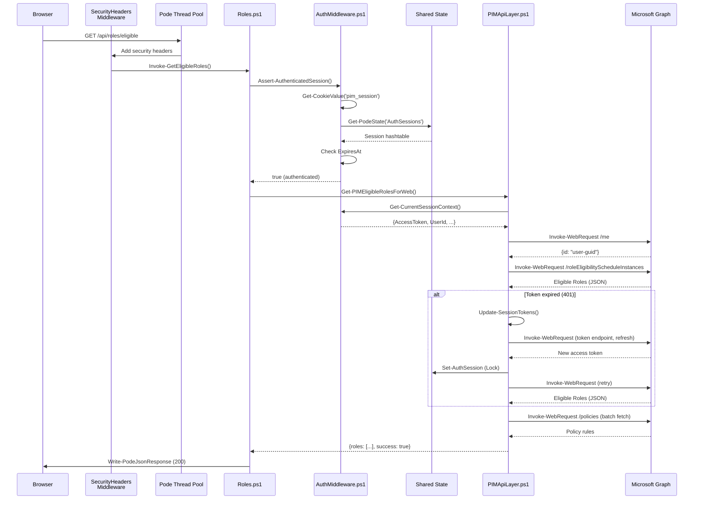
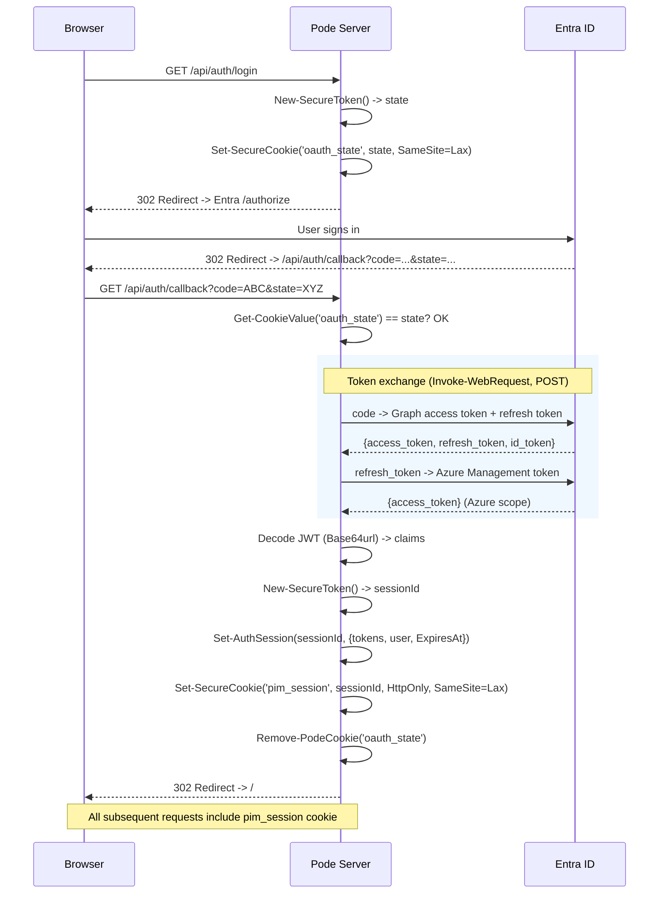
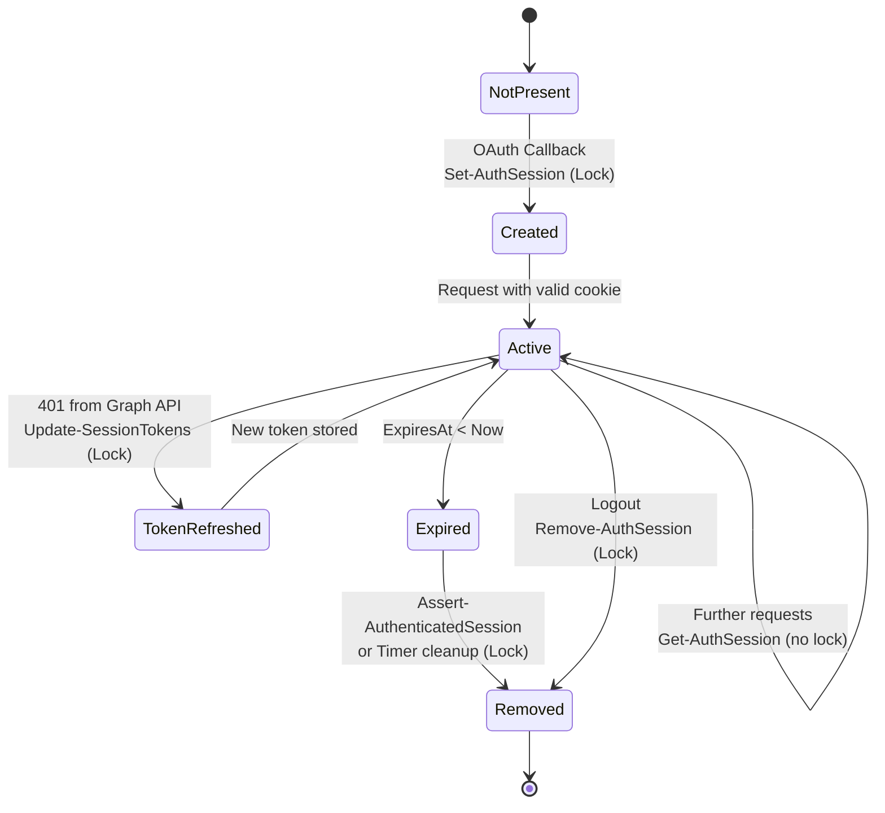

# Architecture & Decisions

This document describes the system architecture of the PIM Activation web application, module dependencies, and the reasoning behind core design decisions (Architecture Decision Records).

> **Audience:** Developers maintaining, extending, or debugging the system.
> **Prerequisite:** Basic PowerShell knowledge. For an introduction to the Pode framework, see [`pode-onboarding.md`](pode-onboarding.md).

---

## 1. System Overview

PIM Activation Web is a Pode-based REST API with an integrated SPA frontend for managing Privileged Identity Management (PIM) roles in Microsoft Entra ID, PIM-enabled groups, and Azure resources.

**Runtime environment:**
- Alpine Linux (Docker container)
- PowerShell 7+ (.NET SDK 8.0)
- Pode web framework (thread pool with 5 worker threads)
- `tini` as PID 1 process manager (signal handling)
- `Invoke-WebRequest` for all HTTP calls (IPv6 DNS fix via `dns:` in docker-compose.yml)



---

## 2. Directory Structure & Module Responsibilities

```
src/pode-app/
├── pim-server.ps1              # Entry point: server config, middleware, route registration
├── modules/
│   ├── Logger.ps1              # Infrastructure: structured JSON logging with level filtering
│   ├── Configuration.ps1       # Infrastructure: environment variable access & validation
│   └── PIMApiLayer.ps1         # Business logic: Graph/Azure API calls, role query & activation
├── middleware/
│   └── AuthMiddleware.ps1      # Cross-cutting: OAuth 2.0, session management, auth guards
├── routes/
│   ├── Roles.ps1               # HTTP layer: role endpoints + Entra audit history
│   └── Config.ps1              # HTTP layer: config, theme, preferences, profiles
└── public/
    ├── index.html              # SPA frontend (entry page)
    ├── css/style.css           # Fluent Design styling (light + dark theme)
    └── js/
        ├── api-client.js       # HTTP client (cookie-based auth)
        ├── app.js              # App init, utilities (toast, progress bar, theme)
        ├── auth.js             # OAuth flow, session management
        ├── roles.js            # Role tables, selection, deactivation
        ├── activation.js       # Activation dialog, batch activation with policy enforcement
        ├── profiles.js         # Saved role profiles (save, activate, delete)
        └── history.js          # Activation history & analytics (local + Entra audit logs)
```

| Layer | Folder | Responsibility |
|-------|--------|---------------|
| **Infrastructure** | `modules/Logger.ps1`, `modules/Configuration.ps1` | Technical cross-cutting functions, no business logic |
| **Business Logic** | `modules/PIMApiLayer.ps1` | API communication, data transformation, role management |
| **Cross-cutting** | `middleware/AuthMiddleware.ps1` | Authentication, session management, cookie handling |
| **HTTP Layer** | `routes/Roles.ps1`, `routes/Config.ps1` | Request validation, handler dispatch, response generation |
| **Frontend** | `public/` | SPA, static assets (no server-side rendering) |

---

## 3. Module Dependencies & Load Order


Scripts are loaded **twice** (see [`pode-onboarding.md`](pode-onboarding.md), section 5):

1. **Dot-sourcing in the main script** (`pim-server.ps1`, search: `# Import custom modules`) — makes functions available for initialization (e.g., `Initialize-Logger`)
2. **`Use-PodeScript` in the server block** (`pim-server.ps1`, search: `Use-PodeScript`) — makes functions available in worker thread runspaces

> **Forward dependency note:** `PIMApiLayer.ps1` loads before `AuthMiddleware.ps1` but uses `Get-CurrentSessionContext`. This works because PowerShell resolves function names at **invocation** time, not at **definition** time (lazy binding).

---

## 4. Request Lifecycle



**Key points:**
- **Security headers middleware** (`pim-server.ps1`, search: `Add-PodeMiddleware -Name 'SecurityHeaders'`) adds HSTS, X-Frame-Options, X-Content-Type-Options, Referrer-Policy, Permissions-Policy to every response
- **No global auth middleware** — each protected route calls `Assert-AuthenticatedSession` explicitly. Some routes (health, config, theme, login) don't require auth.
- **Token retry:** `Invoke-GraphApi` detects `InvalidAuthenticationToken`, refreshes via the stored refresh token, and retries once

---

## 5. Authentication & Session Management

### OAuth 2.0 Authorization Code Flow



### Session Data

| Field | Source | Description |
|-------|--------|-------------|
| `UserId` | JWT claim `oid` / `sub` | Entra object ID |
| `Email` | JWT claim `preferred_username` | UPN or email |
| `Name` | JWT claim `name` | Display name |
| `AccessToken` | Token exchange | Graph API bearer token |
| `AzureAccessToken` | Refresh token exchange | Azure Management bearer token (may be `$null`) |
| `RefreshToken` | Token exchange | For renewing expired tokens |
| `ExpiresAt` | Computed | `(Get-Date).AddSeconds($env:SESSION_TIMEOUT ?? 3600)` |

### Cookie Security

Both cookies use `Set-SecureCookie` (`AuthMiddleware.ps1`, search: `function Set-SecureCookie`) which manually constructs the `Set-Cookie` header to include `SameSite=Lax` (Pode 2.x lacks native SameSite support).

---

## 6. State Management & Thread Safety

### Session State Lifecycle



| Operation | Function | Lock? | Why? |
|-----------|----------|-------|------|
| **Read** | `Get-AuthSession` | No | Acceptable risk: worst case is a single 401. Every handler re-checks via `Assert-AuthenticatedSession`. |
| **Write** | `Set-AuthSession` | Yes | Prevents race conditions during parallel token refreshes |
| **Delete** | `Remove-AuthSession` | Yes | Prevents double-deletion during concurrent logout + timer |
| **Cleanup** | `Clear-ExpiredAuthSessions` | Yes | Timer runs in parallel with request threads |
| **Auth check** | `Assert-AuthenticatedSession` | No | Checks existence AND expiry; removes stale sessions immediately |

### Persistent Storage

User preferences, profiles, and history are stored as JSON files in `/var/pim-data/preferences/` (Docker named volume). Filenames are SHA256 hashes of user IDs for filesystem safety.

---

## 7. Architecture Decision Records (ADRs)

### ADR-1: Invoke-WebRequest with External DNS

| | |
|---|---|
| **Context** | Alpine Linux in Docker has IPv6 DNS resolution issues. Docker's internal DNS (127.0.0.11) returns only AAAA records to .NET, causing `Invoke-WebRequest` to fail. |
| **Decision** | Use `Invoke-WebRequest` (native PowerShell) with `dns: [8.8.8.8, 8.8.4.4]` in docker-compose.yml to get proper A records. |
| **Consequence** | No external binary dependency for HTTP. Tokens never appear in process command-line args. No temp files on disk. |
| **Files** | `PIMApiLayer.ps1` (`Invoke-AzureApi`, `Invoke-GraphApi`), `AuthMiddleware.ps1` (`Invoke-AuthCallback`), `docker-compose.yml` |

### ADR-2: In-Memory Session Store

| | |
|---|---|
| **Context** | Single-container deployment. An external session store (Redis, database) would add complexity and a dependency. |
| **Decision** | Sessions stored as a hashtable in Pode's shared state (`Set-PodeState -Name 'AuthSessions'`). |
| **Consequence** | All sessions lost on container restart (users must re-authenticate). No horizontal scaling across containers. |
| **Files** | `pim-server.ps1` (`Set-PodeState -Name 'AuthSessions'`), `AuthMiddleware.ps1` (`Get-AuthSession` through `Clear-ExpiredAuthSessions`) |

### ADR-3: Per-Route Auth Instead of Middleware Pipeline

| | |
|---|---|
| **Context** | Some endpoints (health, feature config, theme, login, callback) don't require authentication. User preferences return defaults for unauthenticated users. |
| **Decision** | Each protected route handler calls `Assert-AuthenticatedSession` explicitly. No global auth middleware. |
| **Consequence** | Explicit: one look at a handler shows whether auth is checked. The helper makes it a one-liner: `if (-not (Assert-AuthenticatedSession)) { return }` |
| **Files** | `AuthMiddleware.ps1` (`Assert-AuthenticatedSession`), all handlers in `Roles.ps1` and `Config.ps1` (`Invoke-UpdateUserPreferences`) |

### ADR-4: Dual Token Strategy (Graph + Azure Management)

| | |
|---|---|
| **Context** | Microsoft Graph API and Azure Management API use different OAuth scopes. A single token cannot serve both. |
| **Decision** | In the OAuth callback, the refresh token is exchanged for a second access token with Azure Management scope. Both tokens are stored in the session. |
| **Consequence** | Azure roles are only available when the initial token exchange provides a refresh token. The Azure token exchange is non-fatal (errors logged, ignored). |
| **Files** | `AuthMiddleware.ps1` (`Invoke-AuthCallback`, search: `Azure Management token`), `PIMApiLayer.ps1` (`Get-AzureSessionToken`) |

### ADR-5: SHA256 Hashed Filenames for Preferences

| | |
|---|---|
| **Context** | User IDs (Entra OIDs or UPNs) may contain characters invalid for filenames on some platforms. |
| **Decision** | User ID is hashed with SHA256. The hash serves as the filename under `/var/pim-data/preferences/`. |
| **Consequence** | Deterministic (same ID = same hash), filesystem-safe, not easily traceable to a user. |
| **Files** | `Config.ps1` (`Get-UserPrefsFile`) |

### ADR-6: Helper Functions for Deduplication

| | |
|---|---|
| **Context** | Session retrieval (3 lines), auth guards (4 lines), AU scope resolution (14 lines), and role hashtable construction (15 lines) were each duplicated multiple times. |
| **Decision** | Extracted into named helper functions: `Get-CurrentSessionContext`, `Assert-AuthenticatedSession`, `Resolve-DirectoryScopeDisplay`, `New-EntraRoleEntry`, `New-GroupRoleEntry`, `New-AzureRoleEntry`, `Get-AzureRoleVisibility`. |
| **Consequence** | Single point of change per pattern. Consistent behavior. Better readability for mid-level PowerShell developers. |
| **Files** | `AuthMiddleware.ps1` (`Get-CurrentSessionContext`, `Assert-AuthenticatedSession`), `PIMApiLayer.ps1` (`Resolve-DirectoryScopeDisplay` through `New-AzureRoleEntry`), `Roles.ps1` (`Get-AzureRoleVisibility`) |

### ADR-7: Security Headers via Middleware

| | |
|---|---|
| **Context** | Standard web security hardening requires response headers on every request. |
| **Decision** | A Pode middleware (`Add-PodeMiddleware -Name 'SecurityHeaders'`) adds HSTS, X-Frame-Options (DENY), X-Content-Type-Options (nosniff), Referrer-Policy, Permissions-Policy to all responses. |
| **Consequence** | Headers applied globally, no per-route duplication. HSTS only sent over HTTPS. |
| **Files** | `pim-server.ps1` (`Add-PodeMiddleware -Name 'SecurityHeaders'`) |

### ADR-8: SameSite Cookies via Custom Helper

| | |
|---|---|
| **Context** | Pode 2.x lacks native `SameSite` support on `Set-PodeCookie`. The `-Strict` parameter is for cookie signing, not SameSite. |
| **Decision** | Custom `Set-SecureCookie` function constructs the `Set-Cookie` header manually with `SameSite=Lax`, and registers the cookie in Pode's `PendingCookies` for `Remove-PodeCookie` compatibility. |
| **Consequence** | Both `oauth_state` and `pim_session` cookies have explicit `SameSite=Lax`. `Lax` (not `Strict`) because the OAuth callback is a cross-site GET redirect from Entra ID. |
| **Files** | `AuthMiddleware.ps1` (`function Set-SecureCookie`) |

---

## 8. Environment Variable Reference

| Variable | Default | Type | Description |
|----------|---------|------|-------------|
| `ENTRA_TENANT_ID` | *(required)* | string | Entra ID tenant |
| `ENTRA_CLIENT_ID` | *(required)* | string | App registration client ID |
| `ENTRA_CLIENT_SECRET` | *(required)* | string | App registration secret |
| `ENTRA_REDIRECT_URI` | `http://localhost:8080/api/auth/callback` | string | OAuth redirect URI |
| `PODE_PORT` | `8080` | int | Server port |
| `PODE_MODE` | `production` | string | `development` or `production` |
| `LOG_LEVEL` | `Information` | string | `Verbose`, `Debug`, `Information`, `Warning`, `Error` |
| `SESSION_TIMEOUT` | `3600` | int | Session expiry in seconds |
| `PODE_CERT_PATH` | `/etc/pim-certs/cert.pem` | string | TLS certificate (HTTPS) |
| `PODE_CERT_KEY_PATH` | `/etc/pim-certs/key.pem` | string | TLS key (HTTPS) |
| `INCLUDE_ENTRA_ROLES` | `true` | bool | Include Entra ID roles |
| `INCLUDE_GROUPS` | `true` | bool | Include PIM groups |
| `INCLUDE_AZURE_RESOURCES` | `false` | bool | Include Azure resource roles |
| `GRAPH_API_TIMEOUT` | `30000` | int | Graph API timeout (ms) |
| `GRAPH_BATCH_SIZE` | `20` | int | Batch size for API calls |
| `THEME_PRIMARY_COLOR` | `#0078D4` | string | Primary color (CSS) |
| `THEME_SECONDARY_COLOR` | `#107C10` | string | Secondary color |
| `THEME_DANGER_COLOR` | `#DA3B01` | string | Error color |
| `THEME_WARNING_COLOR` | `#FFB900` | string | Warning color |
| `THEME_SUCCESS_COLOR` | `#107C10` | string | Success color |
| `THEME_SECTION_HEADER_COLOR` | `$THEME_PRIMARY_COLOR` | string | Section header |
| `THEME_ENTRA_COLOR` | `#0078D4` | string | Entra role badge color |
| `THEME_GROUP_COLOR` | `#107C10` | string | Group role badge color |
| `THEME_AZURE_COLOR` | `#003067` | string | Azure role badge color |
| `THEME_FONT_FAMILY` | `Segoe UI, -apple-system, sans-serif` | string | Font family |
| `APP_COPYRIGHT` | *(empty)* | string | Footer copyright text |

---

## 9. API Endpoints

| Method | Path | Auth | Handler | Description |
|--------|------|------|---------|-------------|
| GET | `/api/health` | No | *(inline)* | Healthcheck (`{ status: 'healthy' }`) |
| GET | `/api/auth/login` | No | `Invoke-AuthLogin` | Redirect to Entra ID |
| GET | `/api/auth/callback` | No | `Invoke-AuthCallback` | OAuth callback, session creation |
| POST | `/api/auth/logout` | Cookie | `Invoke-AuthLogout` | Delete session |
| GET | `/api/auth/me` | Cookie | `Invoke-AuthMe` | Current user info |
| GET | `/api/roles/eligible` | Yes | `Invoke-GetEligibleRoles` | Available roles |
| GET | `/api/roles/active` | Yes | `Invoke-GetActiveRoles` | Active roles |
| POST | `/api/roles/activate` | Yes | `Invoke-ActivateRole` | Activate role (duration 1-1440 min) |
| POST | `/api/roles/deactivate` | Yes | `Invoke-DeactivateRole` | Deactivate role |
| GET | `/api/roles/policies/:roleId` | Yes | `Invoke-GetRolePolicies` | Policy requirements |
| GET | `/api/history/audits` | Yes | `Invoke-GetAuditHistory` | Entra audit log (last 30 days, max 100) |
| GET | `/api/config/features` | No | `Invoke-GetFeatureConfig` | Feature flags |
| GET | `/api/config/theme` | No | `Invoke-GetThemeConfig` | Theme configuration |
| GET | `/api/user/preferences` | Optional | `Invoke-GetUserPreferences` | User preferences (defaults without auth) |
| POST | `/api/user/preferences` | Yes | `Invoke-UpdateUserPreferences` | Save preferences/profiles/history |
| GET | `/` | No | `Add-PodeStaticRoute` | SPA frontend (`index.html`) |
