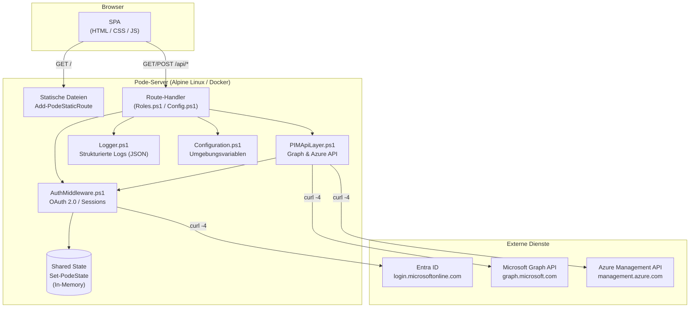
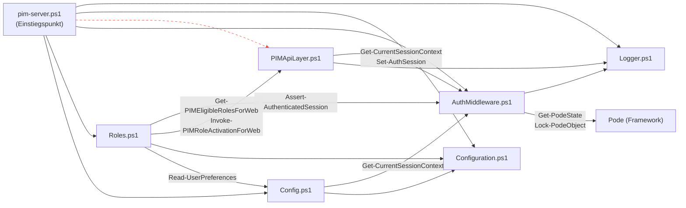
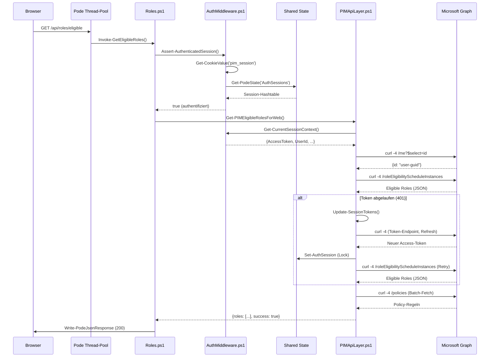
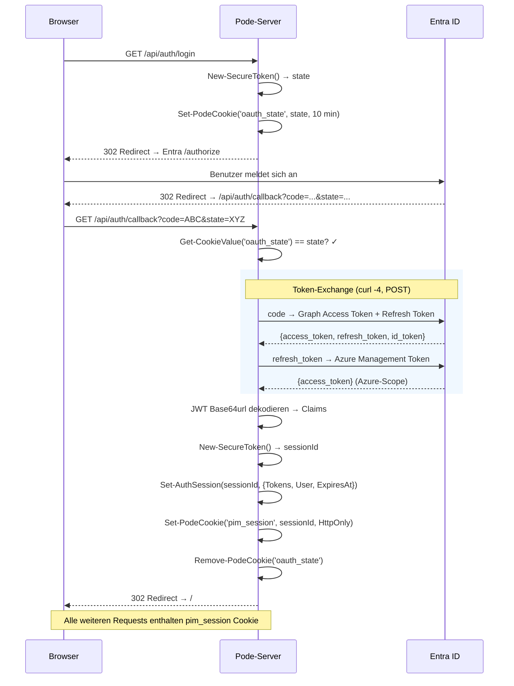
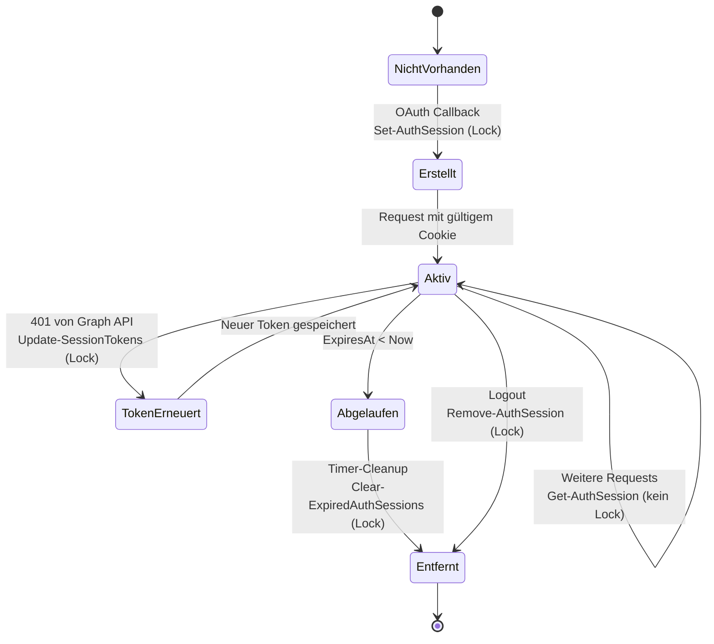

# Architektur & Entscheidungen

Dieses Dokument beschreibt die Systemarchitektur der PIM Activation Web-Anwendung, die Abhängigkeiten zwischen den Modulen und die Gründe hinter den zentralen Designentscheidungen (Architecture Decision Records).

> **Zielgruppe:** Entwickler, die das System warten, erweitern oder debuggen.
> **Voraussetzung:** Grundlegendes PowerShell-Wissen. Für eine Einführung in das Pode-Framework siehe [`pode-onboarding.md`](pode-onboarding.md).

---

## 1. Systemübersicht

PIM Activation Web ist eine Pode-basierte REST-API mit integriertem SPA-Frontend zur Verwaltung von Privileged Identity Management (PIM) Rollen in Microsoft Entra ID, PIM-fähigen Gruppen und Azure-Ressourcen.

**Laufzeitumgebung:**
- Alpine Linux (Docker-Container)
- PowerShell 7+ (.NET SDK 8.0)
- Pode Web-Framework (Thread-Pool mit 5 Worker-Threads)
- `tini` als PID-1-Prozessmanager (Signal-Handling)
- `curl` für alle HTTP-Aufrufe (statt `Invoke-RestMethod`)



---

## 2. Verzeichnisstruktur & Modulaufteilung

```
src/pode-app/
├── pim-server.ps1              # Einstiegspunkt: Server-Konfiguration & Route-Registrierung
├── modules/
│   ├── Logger.ps1              # Infrastruktur: Strukturierte JSON-Logs mit Level-Filterung
│   ├── Configuration.ps1       # Infrastruktur: Umgebungsvariablen-Zugriff & Validierung
│   └── PIMApiLayer.ps1         # Fachlogik: Graph/Azure-API-Aufrufe, Rollen-Abfrage & -Aktivierung
├── middleware/
│   └── AuthMiddleware.ps1      # Querschnitt: OAuth 2.0, Session-Management, Auth-Guards
├── routes/
│   ├── Roles.ps1               # HTTP-Schicht: Route-Handler für Rollen-Endpunkte
│   └── Config.ps1              # HTTP-Schicht: Route-Handler für Konfig/Theme/Preferences
└── public/
    ├── index.html              # SPA-Frontend (Einstiegsseite)
    ├── css/style.css           # Fluent Design Styling
    └── js/                     # Frontend-Logik (api-client, auth, roles, activation)
```

**Warum diese Trennung?**

| Schicht | Ordner | Verantwortung |
|---------|--------|---------------|
| **Infrastruktur** | `modules/Logger.ps1`, `modules/Configuration.ps1` | Technische Querschnittsfunktionen ohne Fachlogik |
| **Fachlogik** | `modules/PIMApiLayer.ps1` | API-Kommunikation, Datenaufbereitung, Rollen-Verwaltung |
| **Querschnitt** | `middleware/AuthMiddleware.ps1` | Authentifizierung, Session-Verwaltung, Cookie-Handling |
| **HTTP-Schicht** | `routes/Roles.ps1`, `routes/Config.ps1` | Request-Validierung, Handler-Dispatch, Response-Erzeugung |
| **Frontend** | `public/` | SPA, statische Assets (kein Server-Side-Rendering) |

### Funktionsübersicht je Datei

| Datei | Funktionen | Beschreibung |
|-------|-----------|--------------|
| `pim-server.ps1` | *(keine exportierten)* | Server-Bootstrap, Route-Registrierung, Timer-Setup |
| `Logger.ps1` | `Initialize-Logger`, `Write-Log` | JSON-Logging mit Level-Filterung und Datei-Ausgabe |
| `Configuration.ps1` | `Get-ConfigValue`, `Get-AllConfig`, `Test-RequiredConfig` | Umgebungsvariablen mit Defaults und Typ-Konvertierung |
| `AuthMiddleware.ps1` | `New-SecureToken`, `Get-AuthSession`, `Set-AuthSession`, `Remove-AuthSession`, `Clear-ExpiredAuthSessions`, `Get-OAuthConfig`, `Get-CookieValue`, `Get-CurrentSessionContext`, `Assert-AuthenticatedSession`, `Invoke-Auth*`, `Get-SessionAccessToken` | OAuth-Flow, Sessions, Cookie-Handling |
| `PIMApiLayer.ps1` | `Invoke-GraphApi`, `Invoke-AzureApi`, `Update-SessionTokens`, `Get-PIMEligibleRolesForWeb`, `Get-PIMActiveRolesForWeb`, `Invoke-PIMRoleActivationForWeb`, `Invoke-PIMRoleDeactivationForWeb`, `Get-PIMRolePolicyForWeb`, `New-*RoleEntry`, `Resolve-DirectoryScopeDisplay` | Alle API-Aufrufe und Rollen-Datenaufbereitung |
| `Roles.ps1` | `Get-AzureRoleVisibility`, `Invoke-GetEligibleRoles`, `Invoke-GetActiveRoles`, `Invoke-ActivateRole`, `Invoke-DeactivateRole`, `Invoke-GetRolePolicies` | Route-Handler mit Auth-Guard und Input-Validierung |
| `Config.ps1` | `Invoke-GetFeatureConfig`, `Invoke-GetThemeConfig`, `Invoke-Get/UpdateUserPreferences`, `Read/Write-UserPreferences`, `Get-UserPrefsFile`, `Get-DefaultPreferences`, `Get-AllowedPreferences` | Konfiguration, Theming, Benutzereinstellungen |

---

## 3. Modulabhängigkeiten & Ladereihenfolge

### Abhängigkeitsgraph



### Ladereihenfolge

Skripte werden **zweimal** geladen (siehe [`pode-onboarding.md`](pode-onboarding.md), Abschnitt 5):

**1. Dot-Sourcing im Hauptskript** (`pim-server.ps1:41-46`) — macht Funktionen für die Initialisierung verfügbar (z.B. `Initialize-Logger`):

```powershell
. (Join-Path $ModulePath 'Logger.ps1')
. (Join-Path $ModulePath 'Configuration.ps1')
. (Join-Path $ModulePath 'PIMApiLayer.ps1')        # Vor AuthMiddleware!
. (Join-Path $MiddlewarePath 'AuthMiddleware.ps1')
. (Join-Path $RoutesPath 'Roles.ps1')
. (Join-Path $RoutesPath 'Config.ps1')
```

**2. `Use-PodeScript` im Server-Block** (`pim-server.ps1:72-77`) — macht Funktionen in Worker-Thread-Runspaces verfügbar.

> **Hinweis zur Forward-Dependency:** `PIMApiLayer.ps1` wird vor `AuthMiddleware.ps1` geladen, nutzt aber deren Funktion `Get-CurrentSessionContext`. Das funktioniert, weil PowerShell Funktionen erst bei **Aufruf** (nicht bei **Definition**) auflöst (Lazy Binding). Zur Laufzeit existieren beide Funktionen bereits im Runspace.

---

## 4. Request-Lebenszyklus

Das folgende Sequenzdiagramm zeigt den vollständigen Weg eines Requests am Beispiel `GET /api/roles/eligible`:



### Eckpunkte

- **Keine Middleware-Pipeline:** Pode unterstützt `Add-PodeMiddleware`, aber diese Anwendung prüft Auth explizit pro Route via `Assert-AuthenticatedSession`. Grund: Einige Routen (Health, Config, Theme, Login) benötigen keine Authentifizierung.
- **Token-Retry:** `Invoke-GraphApi` erkennt `InvalidAuthenticationToken`-Fehler, tauscht den Refresh-Token gegen einen neuen Access-Token und wiederholt den Request einmalig.
- **Alle HTTP-Aufrufe:** Laufen über `curl -s -4` statt `Invoke-RestMethod` (siehe ADR-1).

---

## 5. Authentifizierung & Session-Management

### OAuth 2.0 Authorization Code Flow



### Session-Daten

Jede Session enthält:

| Feld | Quelle | Beschreibung |
|------|--------|-------------|
| `UserId` | JWT-Claim `oid` / `sub` | Entra-Objekt-ID des Benutzers |
| `Email` | JWT-Claim `preferred_username` | UPN oder E-Mail |
| `Name` | JWT-Claim `name` | Anzeigename |
| `AccessToken` | Token-Exchange | Graph-API-Bearer-Token |
| `AzureAccessToken` | Refresh-Token-Exchange | Azure-Management-Bearer-Token (kann `$null` sein) |
| `RefreshToken` | Token-Exchange | Zum Erneuern abgelaufener Tokens |
| `ExpiresAt` | Berechnet | `(Get-Date).AddSeconds($env:SESSION_TIMEOUT ?? 3600)` |
| `CreatedAt` | Erstellungszeitpunkt | Für Audit/Debugging |

---

## 6. State-Management & Thread-Sicherheit

### Session-State-Lebenszyklus



### Regeln für State-Zugriffe

| Operation | Funktion | Lock? | Warum? |
|-----------|----------|-------|--------|
| **Lesen** | `Get-AuthSession` | Nein | Akzeptiertes Risiko: Worst Case ist eine einmalige 401-Antwort wenn eine Session gerade gelöscht wird. Jeder Handler prüft die Session erneut. |
| **Schreiben** | `Set-AuthSession` | Ja | Verhindert Race Conditions bei parallelen Token-Refreshes |
| **Löschen** | `Remove-AuthSession` | Ja | Verhindert doppeltes Löschen bei gleichzeitigem Logout + Timer |
| **Bereinigen** | `Clear-ExpiredAuthSessions` | Ja | Timer läuft parallel zu Request-Threads |

### Logger-State

`LogConfig` wird einmalig bei Serverstart geschrieben (`Initialize-Logger`) und danach nur gelesen. Kein Lock nötig.

---

## 7. Architecture Decision Records (ADRs)

### ADR-1: curl statt Invoke-RestMethod

| | |
|---|---|
| **Kontext** | Alpine Linux im Docker-Container hat IPv6-DNS-Auflösungsprobleme. `Invoke-RestMethod` versucht IPv6-Adressen aufzulösen und hängt dabei. |
| **Entscheidung** | Alle HTTP-Aufrufe (Graph API, Azure API, Token-Exchange) verwenden `/usr/bin/curl -s -4`. Der `-4`-Flag erzwingt IPv4. |
| **Konsequenz** | Request-Bodies werden als temporäre Dateien in `/tmp/` geschrieben (curl `@file`-Syntax). Cleanup erfolgt in `finally`-Blöcken. |
| **Betroffene Dateien** | `PIMApiLayer.ps1` (`Invoke-GraphApi:165`, `Invoke-AzureApi:80`), `AuthMiddleware.ps1` (`Invoke-AuthCallback:246`) |

### ADR-2: In-Memory Session-Speicher

| | |
|---|---|
| **Kontext** | Die Anwendung läuft als Single-Container. Ein externer Session-Store (Redis, Datenbank) würde Komplexität und eine zusätzliche Abhängigkeit einführen. |
| **Entscheidung** | Sessions werden als Hashtable in Podes Shared State gespeichert (`Set-PodeState -Name 'AuthSessions'`). |
| **Konsequenz** | Alle Sessions gehen bei Container-Neustart verloren (Benutzer müssen sich erneut anmelden). Kein horizontales Scaling auf mehrere Container möglich. |
| **Betroffene Dateien** | `pim-server.ps1:80`, `AuthMiddleware.ps1:38-105` |

### ADR-3: Per-Route Auth statt Middleware-Pipeline

| | |
|---|---|
| **Kontext** | Einige Endpunkte (Health, Feature-Config, Theme, Login, Callback) benötigen keine Authentifizierung. User-Preferences geben Defaults für unauthentifizierte Benutzer zurück. |
| **Entscheidung** | Jeder geschützte Route-Handler ruft `Assert-AuthenticatedSession` explizit auf. Keine globale Pode-Middleware. |
| **Konsequenz** | Maximal deutlich: ein Blick in den Handler zeigt, ob Auth geprüft wird. Durch die Helper-Funktion ist es einzeilig (`if (-not (Assert-AuthenticatedSession)) { return }`). |
| **Betroffene Dateien** | `AuthMiddleware.ps1:198`, alle Handler in `Roles.ps1` und `Config.ps1:275` |

### ADR-4: Dual-Token-Strategie (Graph + Azure Management)

| | |
|---|---|
| **Kontext** | Die Microsoft Graph API und die Azure Management API verwenden unterschiedliche OAuth-Scopes. Ein einzelner Token kann nicht beide APIs bedienen. |
| **Entscheidung** | Im OAuth-Callback wird der Refresh-Token gegen einen zweiten Access-Token mit Azure-Management-Scope getauscht. Beide Tokens werden in der Session gespeichert. |
| **Konsequenz** | Azure-Rollen sind nur verfügbar, wenn der initiale Token-Exchange einen Refresh-Token liefert. Der Azure-Token-Exchange ist non-fatal (Fehler werden geloggt, aber ignoriert). |
| **Betroffene Dateien** | `AuthMiddleware.ps1:303-332` (Token-Exchange), `PIMApiLayer.ps1:140` (`Get-AzureSessionToken`) |

### ADR-5: SHA256-gehashte Dateinamen für Preferences

| | |
|---|---|
| **Kontext** | Benutzer-IDs (Entra-OIDs oder UPNs) können Zeichen enthalten, die auf manchen Dateisystemen ungültig sind. |
| **Entscheidung** | Die User-ID wird mit SHA256 gehasht. Der Hash dient als Dateiname unter `/var/pim-data/preferences/`. |
| **Konsequenz** | Deterministisch (gleiche ID = gleicher Hash), dateisystemsicher, nicht ohne Weiteres einem Benutzer zuzuordnen. |
| **Betroffene Dateien** | `Config.ps1:133` (`Get-UserPrefsFile`) |

### ADR-6: Helper-Funktionen zur Deduplizierung

| | |
|---|---|
| **Kontext** | Vor dem Refactoring war der Session-Abruf (3 Zeilen), der Auth-Guard (4 Zeilen), die AU-Scope-Auflösung (14 Zeilen) und die Rollen-Hashtable-Konstruktion (15 Zeilen) jeweils mehrfach dupliziert. |
| **Entscheidung** | Extraktion in benannte Helper-Funktionen: `Get-CurrentSessionContext`, `Assert-AuthenticatedSession`, `Resolve-DirectoryScopeDisplay`, `New-EntraRoleEntry`, `New-GroupRoleEntry`, `New-AzureRoleEntry`, `Get-AzureRoleVisibility`. |
| **Konsequenz** | Einzelne Änderungsstelle pro Muster. Konsistentes Verhalten. Bessere Lesbarkeit für Entwickler mit mittlerem PowerShell-Niveau. |
| **Betroffene Dateien** | `AuthMiddleware.ps1:174-209`, `PIMApiLayer.ps1:292-460`, `Roles.ps1:19-39` |

---

## 8. Umgebungsvariablen-Referenz

| Variable | Standard | Typ | Beschreibung |
|----------|----------|-----|-------------|
| `ENTRA_TENANT_ID` | *(Pflicht)* | string | Entra-ID-Mandant |
| `ENTRA_CLIENT_ID` | *(Pflicht)* | string | App-Registrierung Client-ID |
| `ENTRA_CLIENT_SECRET` | *(Pflicht)* | string | App-Registrierung Secret |
| `ENTRA_REDIRECT_URI` | `http://localhost:8080/api/auth/callback` | string | OAuth-Redirect-URI |
| `PODE_PORT` | `8080` | int | Server-Port |
| `PODE_MODE` | `production` | string | `development` oder `production` |
| `LOG_LEVEL` | `Information` | string | `Verbose`, `Debug`, `Information`, `Warning`, `Error` |
| `SESSION_TIMEOUT` | `3600` | int | Session-Ablaufzeit in Sekunden |
| `PODE_CERT_PATH` | `/etc/pim-certs/cert.pem` | string | TLS-Zertifikat (HTTPS) |
| `PODE_CERT_KEY_PATH` | `/etc/pim-certs/key.pem` | string | TLS-Schlüssel (HTTPS) |
| `INCLUDE_ENTRA_ROLES` | `true` | bool | Entra-ID-Rollen einbeziehen |
| `INCLUDE_GROUPS` | `true` | bool | PIM-Gruppen einbeziehen |
| `INCLUDE_AZURE_RESOURCES` | `false` | bool | Azure-Ressourcen-Rollen einbeziehen |
| `GRAPH_API_TIMEOUT` | `30000` | int | Graph-API-Timeout (ms) |
| `GRAPH_BATCH_SIZE` | `20` | int | Batch-Größe für API-Aufrufe |
| `THEME_PRIMARY_COLOR` | `#0078D4` | string | Primärfarbe (CSS) |
| `THEME_SECONDARY_COLOR` | `#107C10` | string | Sekundärfarbe |
| `THEME_DANGER_COLOR` | `#DA3B01` | string | Fehlerfarbe |
| `THEME_WARNING_COLOR` | `#FFB900` | string | Warnfarbe |
| `THEME_SUCCESS_COLOR` | `#107C10` | string | Erfolgsfarbe |
| `THEME_SECTION_HEADER_COLOR` | `$THEME_PRIMARY_COLOR` | string | Abschnittsüberschrift |
| `THEME_ENTRA_COLOR` | `#0078D4` | string | Badge-Farbe Entra-Rollen |
| `THEME_GROUP_COLOR` | `#107C10` | string | Badge-Farbe Gruppen |
| `THEME_AZURE_COLOR` | `#003067` | string | Badge-Farbe Azure-Rollen |
| `THEME_FONT_FAMILY` | `Segoe UI, -apple-system, sans-serif` | string | Schriftfamilie |
| `APP_COPYRIGHT` | *(leer)* | string | Copyright-Text im Footer |

---

## 9. API-Endpunkte (Kurzreferenz)

| Methode | Pfad | Auth | Handler | Beschreibung |
|---------|------|------|---------|-------------|
| GET | `/api/health` | Nein | *(inline)* | Healthcheck (`{ status: 'healthy' }`) |
| GET | `/api/auth/login` | Nein | `Invoke-AuthLogin` | Redirect zu Entra ID |
| GET | `/api/auth/callback` | Nein | `Invoke-AuthCallback` | OAuth-Callback, Session-Erstellung |
| POST | `/api/auth/logout` | Cookie | `Invoke-AuthLogout` | Session löschen |
| GET | `/api/auth/me` | Cookie | `Invoke-AuthMe` | Aktuelle Benutzerinfo |
| GET | `/api/roles/eligible` | Ja | `Invoke-GetEligibleRoles` | Verfügbare Rollen |
| GET | `/api/roles/active` | Ja | `Invoke-GetActiveRoles` | Aktive Rollen |
| POST | `/api/roles/activate` | Ja | `Invoke-ActivateRole` | Rolle aktivieren |
| POST | `/api/roles/deactivate` | Ja | `Invoke-DeactivateRole` | Rolle deaktivieren |
| GET | `/api/roles/policies/:roleId` | Ja | `Invoke-GetRolePolicies` | Policy-Anforderungen |
| GET | `/api/config/features` | Nein | `Invoke-GetFeatureConfig` | Feature-Flags |
| GET | `/api/config/theme` | Nein | `Invoke-GetThemeConfig` | Theme-Konfiguration |
| GET | `/api/user/preferences` | Optional | `Invoke-GetUserPreferences` | Benutzereinstellungen (Defaults ohne Auth) |
| POST | `/api/user/preferences` | Ja | `Invoke-UpdateUserPreferences` | Einstellungen speichern |
| GET | `/` | Nein | `Add-PodeStaticRoute` | SPA-Frontend (`index.html`) |
