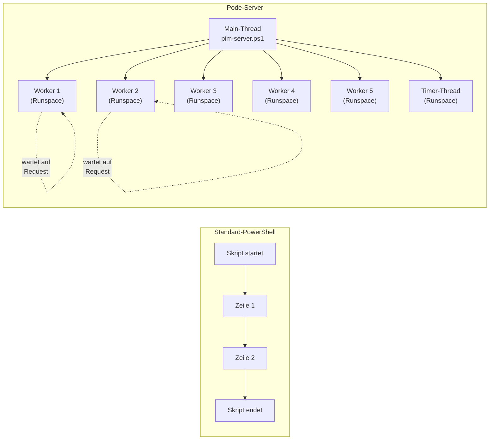
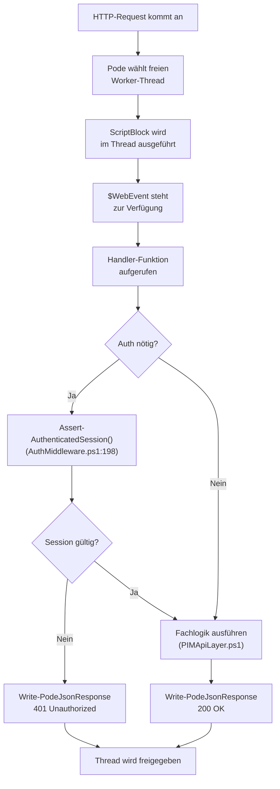
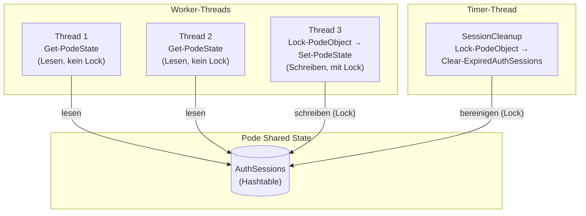

# Pode-Einstieg für PowerShell-Entwickler

Dieses Dokument erklärt das [Pode Web-Framework](https://badgerati.github.io/Pode/) anhand unserer PIM Activation Codebasis. Es richtet sich an Entwickler mit soliden PowerShell-Grundkenntnissen, die noch **keine Erfahrung mit Pode** haben.

> **Ansatz:** Jedes Pode-Konzept wird zuerst auf ein bekanntes PowerShell-Äquivalent abgebildet, dann anhand konkreter Dateien im Repository demonstriert.
> **Architektur-Details:** Für die Designentscheidungen hinter dieser Anwendung siehe [`architecture.md`](architecture.md).

---

## 1. Was ist Pode und warum nutzen wir es?

**Pode** ist ein leichtgewichtiges, in PowerShell geschriebenes Web-Framework. Es stellt einen HTTP-Server bereit, der Routen, statische Dateien, Timer und Middleware unterstützt — ohne IIS, Apache oder ASP.NET.

**Vergleich:**
- In **Node.js** ist Pode vergleichbar mit `http.createServer()` bzw. Express.
- In **Python** entspricht es Flask oder FastAPI.
- In **PowerShell** gibt es kein eingebautes Äquivalent — `Invoke-RestMethod` ist ein *Client*, Pode ist ein *Server*.

**Warum Pode in diesem Projekt?**
- Läuft nativ in PowerShell 7 — keine Kompilierung, kein Build-Step
- Docker-freundlich (Alpine Linux, ~100 MB Image)
- Alle Module bleiben reines PowerShell (`.ps1`-Dateien)
- Thread-Pool für parallele Request-Verarbeitung eingebaut

---

## 2. Das mentale Modell: Pode vs. normales PowerShell-Skript

### Standard-PowerShell

Ein normales Skript läuft **sequenziell** in einem einzigen Thread und endet, wenn die letzte Zeile erreicht ist:

```powershell
# Standard-Skript: ein Thread, läuft durch, endet
$data = Get-Content './daten.json' | ConvertFrom-Json
$data | ForEach-Object { Write-Output $_.Name }
# Skript ist fertig → Prozess endet
```

### Pode

Ein Pode-Server startet und **wartet endlos** auf eingehende HTTP-Requests. Mehrere Requests werden **parallel** in einem Thread-Pool verarbeitet:



**Das ist der zentrale Unterschied:** Ein Pode-Server ist ein Endlos-Prozess mit mehreren parallelen Threads. Jeder Thread ist ein eigener **Runspace** — ein isolierter PowerShell-Ausführungskontext mit eigenem Variablen-Scope.

> **In unserem Repo:** `pim-server.ps1:55` startet den Server mit 5 Worker-Threads:
> ```powershell
> Start-PodeServer -Name 'PIM-Activation' -Threads 5 {
>     # Alles in diesem Block = Server-Konfiguration
> }
> ```

---

## 3. Server starten: `Start-PodeServer` verstehen

`Start-PodeServer` nimmt einen **ScriptBlock** entgegen. Dieser Block wird **nicht sofort ausgeführt** — er definiert, *was der Server tun soll*, wenn er läuft.

**PowerShell-Analogie:** Der ScriptBlock ist vergleichbar mit `Register-EngineEvent` — er beschreibt das Verhalten, das bei bestimmten Events ausgelöst wird.

### Was passiert in unserem Server-Block?

```powershell
# pim-server.ps1:55
Start-PodeServer -Name 'PIM-Activation' -Threads 5 {
    # 1. Endpunkt konfigurieren (HTTP oder HTTPS)
    Add-PodeEndpoint -Address * -Port $serverPort -Protocol Http    # Zeile 67

    # 2. Skripte in Worker-Runspaces laden
    Use-PodeScript -Path '...'                                      # Zeilen 72-77

    # 3. Shared State initialisieren
    Set-PodeState -Name 'AuthSessions' -Value @{} | Out-Null       # Zeile 80

    # 4. Timer registrieren
    Add-PodeTimer -Name 'SessionCleanup' -Interval 300 ...         # Zeile 83

    # 5. Routen registrieren
    Add-PodeRoute -Method Get -Path '/api/health' -ScriptBlock ...  # Zeilen 91-157

    # 6. Statische Dateien konfigurieren
    Add-PodeStaticRoute -Path '/' -Source $publicPath ...           # Zeile 157
}
```

### Endpunkt-Konfiguration

Der Server entscheidet zur Laufzeit, ob er HTTPS oder HTTP verwendet:

```powershell
# pim-server.ps1:62-69
if ((Test-Path $certPath) -and (Test-Path $keyPath)) {
    Add-PodeEndpoint -Address * -Port $serverPort -Protocol Https `
        -Certificate $certPath -CertificateKey $keyPath
}
else {
    Add-PodeEndpoint -Address * -Port $serverPort -Protocol Http
}
```

`-Address *` bedeutet: auf allen Netzwerk-Interfaces lauschen (wie `0.0.0.0` in anderen Frameworks).

---

## 4. Routen registrieren: `Add-PodeRoute`

### Grundsyntax

```powershell
Add-PodeRoute -Method Get -Path '/api/health' -ScriptBlock {
    # Dieser Code läuft in einem Worker-Thread, wenn ein GET /api/health kommt
    Write-PodeJsonResponse -Value @{ status = 'healthy' }
}
```

### Die magische Variable: `$WebEvent`

In jedem Route-ScriptBlock stellt Pode automatisch die Variable `$WebEvent` bereit. Sie enthält alle Informationen über den eingehenden Request.

**PowerShell-Analogie:** `$WebEvent` ist wie `$_` (`$PSItem`) in einer Pipeline — eine automatische Variable, die der aktuelle Kontext bereitstellt.

| `$WebEvent`-Eigenschaft | Beschreibung | Beispiel |
|--------------------------|-------------|---------|
| `$WebEvent.Query` | URL-Query-Parameter | `$WebEvent.Query['code']` in `AuthMiddleware.ps1:253` |
| `$WebEvent.Data` | Geparster JSON-Body (POST) | `$WebEvent.Data.roleId` in `Roles.ps1:111` |
| `$WebEvent.Parameters` | Pfad-Parameter (`:param`) | `$WebEvent.Parameters.roleId` in `pim-server.ps1:134` |
| `$WebEvent.Request` | Das rohe Request-Objekt | Weitergereicht an Handler-Funktionen |

### Unser Muster: Route → Handler-Funktion

Statt die gesamte Logik in den ScriptBlock zu schreiben, rufen unsere Routen benannte Funktionen auf:

```powershell
# pim-server.ps1:117-119
Add-PodeRoute -Method Get -Path '/api/roles/eligible' -ScriptBlock {
    Invoke-GetEligibleRoles -Request $WebEvent.Request
}
```

Die eigentliche Logik steckt in `Invoke-GetEligibleRoles` (`routes/Roles.ps1:42`). Dieser Ansatz hält die Route-Registrierung übersichtlich und die Handler-Logik testbar.

### Request-Verarbeitung im Detail



### Route mit Pfad-Parametern

Pode unterstützt dynamische Pfad-Segmente mit `:parameter`:

```powershell
# pim-server.ps1:133-135
Add-PodeRoute -Method Get -Path '/api/roles/policies/:roleId' -ScriptBlock {
    Invoke-GetRolePolicies -Request $WebEvent.Request -RoleId $WebEvent.Parameters.roleId
}
```

`:roleId` wird aus der URL extrahiert und steht als `$WebEvent.Parameters.roleId` zur Verfügung. Vergleichbar mit `$Matches` nach einem Regex-Match.

---

## 5. Funktionen in Routen verfügbar machen: `Use-PodeScript`

### Das Problem

Route-ScriptBlocks laufen in **eigenen Runspaces** (Worker-Threads). Funktionen, die im Hauptskript definiert sind, existieren dort **nicht**.

```powershell
# Das funktioniert NICHT:
function Get-Greeting { return "Hallo" }

Start-PodeServer {
    Add-PodeRoute -Method Get -Path '/greet' -ScriptBlock {
        $msg = Get-Greeting   # FEHLER: Funktion existiert in diesem Runspace nicht!
        Write-PodeJsonResponse -Value @{ message = $msg }
    }
}
```

**PowerShell-Analogie:** Das gleiche Problem tritt bei `ForEach-Object -Parallel` auf:

```powershell
function Get-Greeting { return "Hallo" }

1..5 | ForEach-Object -Parallel {
    Get-Greeting   # FEHLER: Funktion existiert im Parallel-Runspace nicht!
}
```

### Die Lösung: `Use-PodeScript`

`Use-PodeScript` importiert eine Skriptdatei in **alle** Worker-Runspaces:

```powershell
Start-PodeServer {
    Use-PodeScript -Path './modules/Logger.ps1'   # Funktionen in allen Threads verfügbar

    Add-PodeRoute -Method Get -Path '/log' -ScriptBlock {
        Write-Log -Message "Request erhalten"       # Funktioniert jetzt!
    }
}
```

**PowerShell-Analogie:** `Use-PodeScript` ist wie `Import-Module` in jedem Runspace eines `ForEach-Object -Parallel`-Blocks.

### Warum wir doppelt laden

In unserem Projekt werden alle Skripte **zweimal** importiert:

```powershell
# pim-server.ps1

# ERSTER Import: Dot-Sourcing im Hauptskript (Zeilen 41-46)
. (Join-Path $ModulePath 'Logger.ps1')        # Für Initialize-Logger VOR Serverstart
. (Join-Path $ModulePath 'Configuration.ps1')
. (Join-Path $ModulePath 'PIMApiLayer.ps1')
. (Join-Path $MiddlewarePath 'AuthMiddleware.ps1')
. (Join-Path $RoutesPath 'Roles.ps1')
. (Join-Path $RoutesPath 'Config.ps1')

Initialize-Logger -Level $LogLevel -Path '/var/log/pim/pode.log'  # Zeile 49
Write-Log -Message "Starting..."                                   # Zeile 51

Start-PodeServer -Threads 5 {
    # ZWEITER Import: Use-PodeScript für Worker-Threads (Zeilen 72-77)
    Use-PodeScript -Path (Join-Path $PSScriptRoot 'modules' 'Logger.ps1')
    Use-PodeScript -Path (Join-Path $PSScriptRoot 'modules' 'Configuration.ps1')
    # ...
}
```

| Import | Methode | Zweck | Scope |
|--------|---------|-------|-------|
| Erster | Dot-Sourcing (`. ./datei.ps1`) | Funktionen für **Initialisierung** verfügbar machen | Main-Thread |
| Zweiter | `Use-PodeScript` | Funktionen für **Route-Handler** verfügbar machen | Worker-Threads |

Ohne den ersten Import könnte `Initialize-Logger` (Zeile 49) nicht aufgerufen werden, weil `Start-PodeServer` noch nicht gestartet ist. Ohne den zweiten Import hätten die Route-Handler keinen Zugriff auf `Write-Log`, `Get-AuthSession`, etc.

---

## 6. Shared State: Daten zwischen Threads teilen

### Das Problem

Jeder Worker-Thread hat seinen eigenen Variablen-Scope. Eine Variable, die in Thread 1 gesetzt wird, ist in Thread 2 unsichtbar:

```powershell
# Das funktioniert NICHT:
$sessions = @{}   # Nur im Main-Thread sichtbar

Start-PodeServer {
    Add-PodeRoute -Method Get -Path '/test' -ScriptBlock {
        $sessions['key'] = 'value'   # $sessions existiert hier nicht!
    }
}
```

**PowerShell-Analogie:** Dasselbe Problem wie bei `ForEach-Object -Parallel`, wo man `$using:` braucht:

```powershell
$sharedData = [hashtable]::Synchronized(@{})
1..5 | ForEach-Object -Parallel {
    ($using:sharedData)['key'] = 'value'   # $using: nötig für Zugriff
}
```

### Die Lösung: `Set-PodeState` / `Get-PodeState`

Pode bietet einen eingebauten Mechanismus für geteilte Daten:

```powershell
# Initialisierung (einmalig im Server-Block)
Set-PodeState -Name 'AuthSessions' -Value @{} | Out-Null   # pim-server.ps1:80

# Lesen (aus jedem Thread)
$sessions = Get-PodeState -Name 'AuthSessions'              # AuthMiddleware.ps1:47

# Schreiben (mit Lock für Thread-Sicherheit)
Lock-PodeObject -Object (Get-PodeState -Name 'AuthSessions') -ScriptBlock {
    $sessions = Get-PodeState -Name 'AuthSessions'
    $sessions[$SessionId] = $Data
    Set-PodeState -Name 'AuthSessions' -Value $sessions | Out-Null
}   # AuthMiddleware.ps1:65-78
```

### Thread-Sicherheit mit `Lock-PodeObject`

Wenn mehrere Threads gleichzeitig denselben State schreiben, entstehen **Race Conditions**. `Lock-PodeObject` verhindert das:



**PowerShell-Analogie:** `Lock-PodeObject` entspricht `[System.Threading.Monitor]::Enter()` / `Exit()` — es stellt sicher, dass nur ein Thread gleichzeitig den geschützten Bereich betritt.

### Konkrete Funktionen in unserem Repo

| Funktion | Datei | Lock? | Operation |
|----------|-------|-------|-----------|
| `Get-AuthSession` | `AuthMiddleware.ps1:38` | Nein | Liest eine Session aus dem State |
| `Set-AuthSession` | `AuthMiddleware.ps1:61` | Ja | Erstellt/aktualisiert eine Session |
| `Remove-AuthSession` | `AuthMiddleware.ps1:86` | Ja | Löscht eine Session |
| `Clear-ExpiredAuthSessions` | `AuthMiddleware.ps1:105` | Ja | Entfernt abgelaufene Sessions |

---

## 7. Cookies: `Set-PodeCookie` / `Get-PodeCookie`

Pode verwaltet HTTP-Cookies als First-Class-Konzept. Keine manuelle Header-Manipulation nötig.

### Cookie setzen

```powershell
# AuthMiddleware.ps1:351-353
Set-PodeCookie -Name 'pim_session' `
    -Value $sessionId `
    -ExpiryDate ([datetime]::UtcNow.AddSeconds($sessionTimeout)) `
    -HttpOnly `            # JavaScript kann den Cookie nicht lesen (XSS-Schutz)
    -Secure:$isHttps       # Nur über HTTPS senden (dynamisch)
```

### Cookie lesen

```powershell
$cookie = Get-PodeCookie -Name 'pim_session'
```

> **Hinweis:** `Get-PodeCookie` gibt je nach Pode-Version ein Hashtable oder einen String zurück. Deshalb existiert in unserem Repo der Wrapper `Get-CookieValue` (`AuthMiddleware.ps1:153`), der das Ergebnis normalisiert.

### Cookie löschen

```powershell
Remove-PodeCookie -Name 'oauth_state'   # AuthMiddleware.ps1:354
```

### Cookie-Lebenszyklus in unserer App

1. **Login:** `oauth_state`-Cookie gesetzt (10 Minuten gültig, CSRF-Schutz)
2. **Callback:** `oauth_state` gelöscht, `pim_session`-Cookie gesetzt (1 Stunde gültig)
3. **Requests:** Browser sendet `pim_session` automatisch mit jedem Request
4. **Logout:** `pim_session`-Cookie gelöscht (Server + Client)

---

## 8. Antworten senden

### JSON-Antworten: `Write-PodeJsonResponse`

Die am häufigsten verwendete Funktion in unserem Projekt. Serialisiert ein PowerShell-Objekt zu JSON und sendet es als HTTP-Response.

```powershell
# Erfolgreiche Antwort (200 ist Standard)
Write-PodeJsonResponse -Value @{
    success = $true
    roles   = @($allRoles)
}

# Fehler-Antwort mit Status-Code
Write-PodeJsonResponse -Value @{
    success = $false
    error   = 'Not authenticated'
} -StatusCode 401
```

**PowerShell-Analogie:** `ConvertTo-Json | Write-Output`, aber Pode setzt automatisch den `Content-Type: application/json`-Header und den HTTP-Statuscode.

### Redirects: `Move-PodeResponseUrl`

Sendet eine HTTP 302-Weiterleitung:

```powershell
# AuthMiddleware.ps1:235 — Nach erfolgreichem Login
Move-PodeResponseUrl -Url '/'

# AuthMiddleware.ps1:257 — Weiterleitung zu Entra ID
Move-PodeResponseUrl -Url "$($oauth.AuthorizeUrl)?$($query.ToString())"
```

**Wann verwendet?** Ausschließlich im OAuth-Flow: Login-Redirect zu Entra ID, und Redirect zurück zur App nach dem Callback.

---

## 9. Timer: Wiederkehrende Aufgaben

`Add-PodeTimer` registriert eine Funktion, die in regelmäßigen Abständen ausgeführt wird — in einem **eigenen Thread**, unabhängig von Requests.

```powershell
# pim-server.ps1:83-85
Add-PodeTimer -Name 'SessionCleanup' -Interval 300 -ScriptBlock {
    Clear-ExpiredAuthSessions
}
```

Das bedeutet: Alle 300 Sekunden (5 Minuten) ruft Pode `Clear-ExpiredAuthSessions` auf, um abgelaufene Sessions aus dem Shared State zu entfernen.

**PowerShell-Analogie:** Vergleichbar mit `Register-ObjectEvent` auf einem `System.Timers.Timer`:

```powershell
# Standard-PowerShell-Äquivalent (konzeptionell):
$timer = New-Object System.Timers.Timer(300000)
Register-ObjectEvent -InputObject $timer -EventName Elapsed -Action {
    Clear-ExpiredAuthSessions
}
$timer.Start()
```

Pode abstrahiert das und kümmert sich um Thread-Management und Error-Handling.

---

## 10. Statische Dateien: `Add-PodeStaticRoute`

Pode kann CSS, JavaScript, Bilder und HTML direkt ausliefern — kein separater Nginx oder Apache nötig.

```powershell
# pim-server.ps1:156-158
if (Test-Path $publicPath) {
    Add-PodeStaticRoute -Path '/' -Source $publicPath -Defaults @('index.html')
}
```

| Parameter | Wert | Bedeutung |
|-----------|------|-----------|
| `-Path '/'` | `/` | URL-Präfix, unter dem die Dateien erreichbar sind |
| `-Source $publicPath` | `./public` | Lokales Verzeichnis mit den Dateien |
| `-Defaults @('index.html')` | `index.html` | Standarddatei, wenn nur das Verzeichnis aufgerufen wird |

**Ergebnis:**
- `GET /` → `public/index.html`
- `GET /css/style.css` → `public/css/style.css`
- `GET /js/app.js` → `public/js/app.js`

Die API-Routen (`/api/*`) haben Vorrang vor statischen Dateien, weil sie explizit mit `Add-PodeRoute` registriert sind.

---

## 11. Zusammenfassung: Pode-Konzepte auf einen Blick

| Pode-Konzept | Standard-PowerShell-Analogie | Beispiel im Repo |
|---|---|---|
| `Start-PodeServer -Threads 5` | `ForEach-Object -Parallel -ThrottleLimit 5` (Endlos-Schleife) | `pim-server.ps1:55` |
| `Add-PodeEndpoint` | `[System.Net.HttpListener]::new()` | `pim-server.ps1:63/67` |
| `Add-PodeRoute` | `Register-EngineEvent` mit HTTP-Trigger | `pim-server.ps1:91-153` |
| `$WebEvent` | `$_` / `$PSItem` in Pipeline-Blöcken | `routes/Roles.ps1:111` |
| `$WebEvent.Data` | Geparster JSON-Body | `routes/Roles.ps1:111` |
| `$WebEvent.Parameters` | `$Matches` nach Regex-Match | `pim-server.ps1:134` |
| `Use-PodeScript` | `Import-Module` in jedem Parallel-Runspace | `pim-server.ps1:72-77` |
| `Set-PodeState` / `Get-PodeState` | `$using:hashTable` in `ForEach-Object -Parallel` | `pim-server.ps1:80`, `AuthMiddleware.ps1:47` |
| `Lock-PodeObject` | `[Threading.Monitor]::Enter()` / `Exit()` | `AuthMiddleware.ps1:65` |
| `Write-PodeJsonResponse` | `ConvertTo-Json \| Write-Output` + HTTP-Header | `routes/Roles.ps1:56` |
| `Move-PodeResponseUrl` | Manueller `Location`-Header setzen | `AuthMiddleware.ps1:235` |
| `Set-PodeCookie` | Manueller `Set-Cookie`-Header | `AuthMiddleware.ps1:351` |
| `Get-PodeCookie` | Cookie aus Request-Header parsen | `AuthMiddleware.ps1:159` |
| `Add-PodeTimer` | `Register-ObjectEvent` auf `System.Timers.Timer` | `pim-server.ps1:83` |
| `Add-PodeStaticRoute` | Datei lesen + als Response senden | `pim-server.ps1:157` |

---

## Nächste Schritte

1. **Projekt lokal starten:** Siehe [`README.md`](README.md) für Docker-Setup und Umgebungsvariablen.
2. **Architektur verstehen:** Lies [`architecture.md`](architecture.md) für Modulabhängigkeiten und ADRs.
3. **Eigene Route hinzufügen:** Erstelle eine Funktion in `routes/`, importiere sie via `Use-PodeScript` in `pim-server.ps1`, und registriere die Route mit `Add-PodeRoute`.
4. **Pode-Dokumentation:** [badgerati.github.io/Pode](https://badgerati.github.io/Pode/) für das vollständige Framework-Handbuch.
