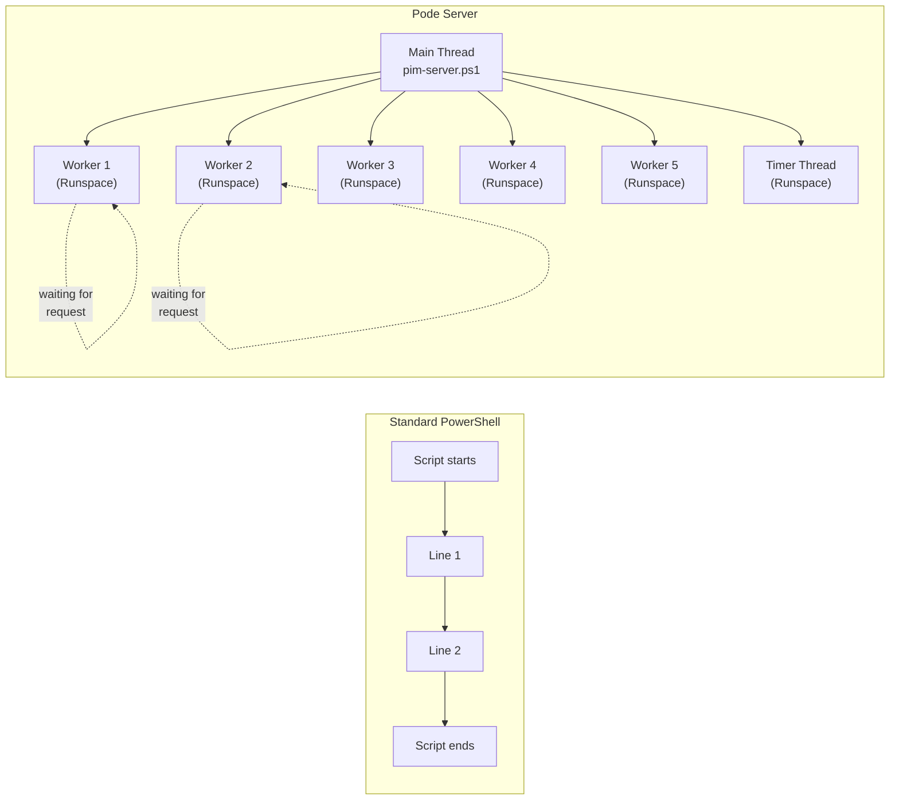
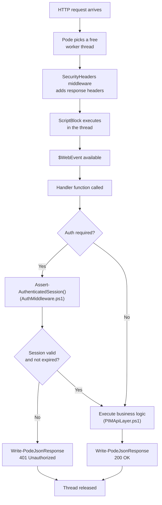
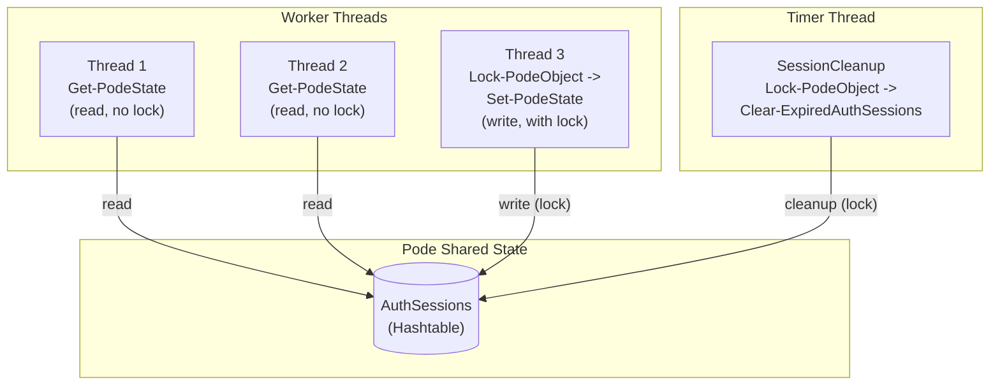

# Pode Onboarding for PowerShell Developers

This document explains the [Pode web framework](https://badgerati.github.io/Pode/) using our PIM Activation codebase. It targets developers with solid PowerShell skills who have **no prior experience with Pode**.

> **Approach:** Each Pode concept is first mapped to a familiar PowerShell equivalent, then demonstrated with concrete files from this repository.
> **Architecture details:** For design decisions behind this application, see [`architecture.md`](architecture.md).

---

## 1. What Is Pode and Why Do We Use It?

**Pode** is a lightweight web framework written in PowerShell. It provides an HTTP server with routes, static files, timers, and middleware — without IIS, Apache, or ASP.NET.

**Comparisons:**
- In **Node.js**, Pode is comparable to `http.createServer()` or Express.
- In **Python**, it corresponds to Flask or FastAPI.
- In **PowerShell**, there is no built-in equivalent — `Invoke-RestMethod` is a *client*, Pode is a *server*.

**Why Pode in this project?**
- Runs natively in PowerShell 7 — no compilation, no build step
- Docker-friendly (Alpine Linux, ~100 MB image)
- All modules remain pure PowerShell (`.ps1` files)
- Built-in thread pool for parallel request handling

---

## 2. The Mental Model: Pode vs. a Normal PowerShell Script

### Standard PowerShell

A normal script runs **sequentially** in a single thread and exits when the last line is reached:

```powershell
# Standard script: one thread, runs through, ends
$data = Get-Content './data.json' | ConvertFrom-Json
$data | ForEach-Object { Write-Output $_.Name }
# Script finished → process exits
```

### Pode

A Pode server starts and **waits indefinitely** for incoming HTTP requests. Multiple requests are processed **in parallel** in a thread pool:



**This is the key difference:** A Pode server is a long-running process with multiple parallel threads. Each thread is its own **runspace** — an isolated PowerShell execution context with its own variable scope.

> **In our repo:** `pim-server.ps1` starts the server with 5 worker threads:
> ```powershell
> Start-PodeServer -Name 'PIM-Activation' -Threads 5 {
>     # Everything in this block = server configuration
> }
> ```

---

## 3. Starting the Server: Understanding `Start-PodeServer`

`Start-PodeServer` takes a **ScriptBlock**. This block is **not executed immediately** — it defines *what the server should do* when running.

**PowerShell analogy:** The ScriptBlock is comparable to `Register-EngineEvent` — it describes behavior triggered by events.

### What Happens in Our Server Block?

```powershell
# pim-server.ps1
Start-PodeServer -Name 'PIM-Activation' -Threads 5 {
    # 1. Configure endpoint (HTTP or HTTPS)
    Add-PodeEndpoint -Address * -Port $serverPort -Protocol Http

    # 2. Security headers middleware
    Add-PodeMiddleware -Name 'SecurityHeaders' -ScriptBlock { ... }

    # 3. Load scripts into worker runspaces
    Use-PodeScript -Path '...'

    # 4. Initialize shared state
    Set-PodeState -Name 'AuthSessions' -Value @{} | Out-Null

    # 5. Register timer
    Add-PodeTimer -Name 'SessionCleanup' -Interval 300 ...

    # 6. Register routes
    Add-PodeRoute -Method Get -Path '/api/health' -ScriptBlock ...

    # 7. Configure static files
    Add-PodeStaticRoute -Path '/' -Source $publicPath ...
}
```

### Endpoint Configuration

The server decides at runtime whether to use HTTPS or HTTP:

```powershell
# pim-server.ps1 — inside the server block
if ((Test-Path $certPath) -and (Test-Path $keyPath)) {
    Add-PodeEndpoint -Address * -Port $serverPort -Protocol Https `
        -Certificate $certPath -CertificateKey $keyPath
}
else {
    Add-PodeEndpoint -Address * -Port $serverPort -Protocol Http
}
```

`-Address *` means: listen on all network interfaces (like `0.0.0.0` in other frameworks).

---

## 4. Registering Routes: `Add-PodeRoute`

### Basic Syntax

```powershell
Add-PodeRoute -Method Get -Path '/api/health' -ScriptBlock {
    # This code runs in a worker thread when GET /api/health arrives
    Write-PodeJsonResponse -Value @{ status = 'healthy' }
}
```

### The Magic Variable: `$WebEvent`

In every route ScriptBlock, Pode automatically provides the `$WebEvent` variable. It contains all information about the incoming request.

**PowerShell analogy:** `$WebEvent` is like `$_` (`$PSItem`) in a pipeline — an automatic variable provided by the current context.

| `$WebEvent` Property | Description | Example |
|----------------------|-------------|---------|
| `$WebEvent.Query` | URL query parameters | `$WebEvent.Query['code']` in `AuthMiddleware.ps1` (`Invoke-AuthCallback`) |
| `$WebEvent.Data` | Parsed JSON body (POST) | `$WebEvent.Data.roleId` in `Roles.ps1` (`Invoke-ActivateRole`) |
| `$WebEvent.Parameters` | Path parameters (`:param`) | `$WebEvent.Parameters.roleId` in `pim-server.ps1` (policies route) |
| `$WebEvent.Request` | The raw request object | Passed to handler functions |

### Our Pattern: Route → Handler Function

Instead of putting all logic in the ScriptBlock, our routes call named functions:

```powershell
# pim-server.ps1
Add-PodeRoute -Method Get -Path '/api/roles/eligible' -ScriptBlock {
    Invoke-GetEligibleRoles -Request $WebEvent.Request
}
```

The actual logic lives in `Invoke-GetEligibleRoles` (`routes/Roles.ps1`). This keeps route registration clean and handler logic testable.

### Request Processing Flow



### Routes with Path Parameters

Pode supports dynamic path segments with `:parameter`:

```powershell
# pim-server.ps1
Add-PodeRoute -Method Get -Path '/api/roles/policies/:roleId' -ScriptBlock {
    Invoke-GetRolePolicies -Request $WebEvent.Request -RoleId $WebEvent.Parameters.roleId
}
```

`:roleId` is extracted from the URL and available as `$WebEvent.Parameters.roleId`. Comparable to `$Matches` after a regex match.

---

## 5. Making Functions Available in Routes: `Use-PodeScript`

### The Problem

Route ScriptBlocks run in **their own runspaces** (worker threads). Functions defined in the main script **don't exist** there.

```powershell
# This does NOT work:
function Get-Greeting { return "Hello" }

Start-PodeServer {
    Add-PodeRoute -Method Get -Path '/greet' -ScriptBlock {
        $msg = Get-Greeting   # ERROR: function doesn't exist in this runspace!
        Write-PodeJsonResponse -Value @{ message = $msg }
    }
}
```

**PowerShell analogy:** The same problem occurs with `ForEach-Object -Parallel`:

```powershell
function Get-Greeting { return "Hello" }

1..5 | ForEach-Object -Parallel {
    Get-Greeting   # ERROR: function doesn't exist in the parallel runspace!
}
```

### The Solution: `Use-PodeScript`

`Use-PodeScript` imports a script file into **all** worker runspaces:

```powershell
Start-PodeServer {
    Use-PodeScript -Path './modules/Logger.ps1'   # Functions available in all threads

    Add-PodeRoute -Method Get -Path '/log' -ScriptBlock {
        Write-Log -Message "Request received"       # Works now!
    }
}
```

**PowerShell analogy:** `Use-PodeScript` is like `Import-Module` in every runspace of a `ForEach-Object -Parallel` block.

### Why We Load Twice

In our project, all scripts are imported **twice**:

```powershell
# pim-server.ps1

# FIRST import: dot-sourcing in the main script
. (Join-Path $ModulePath 'Logger.ps1')        # For Initialize-Logger BEFORE server start
. (Join-Path $ModulePath 'Configuration.ps1')
# ...

Initialize-Logger -Level $LogLevel -Path '/var/log/pim/pode.log'
Write-Log -Message "Starting..."

Start-PodeServer -Threads 5 {
    # SECOND import: Use-PodeScript for worker threads
    Use-PodeScript -Path (Join-Path $PSScriptRoot 'modules' 'Logger.ps1')
    Use-PodeScript -Path (Join-Path $PSScriptRoot 'modules' 'Configuration.ps1')
    # ...
}
```

| Import | Method | Purpose | Scope |
|--------|--------|---------|-------|
| First | Dot-sourcing (`. ./file.ps1`) | Functions available for **initialization** | Main thread |
| Second | `Use-PodeScript` | Functions available for **route handlers** | Worker threads |

Without the first import, `Initialize-Logger` couldn't be called because `Start-PodeServer` hasn't started yet. Without the second import, route handlers would have no access to `Write-Log`, `Get-AuthSession`, etc.

---

## 6. Shared State: Sharing Data Between Threads

### The Problem

Each worker thread has its own variable scope. A variable set in thread 1 is invisible in thread 2:

```powershell
# This does NOT work:
$sessions = @{}   # Only visible in the main thread

Start-PodeServer {
    Add-PodeRoute -Method Get -Path '/test' -ScriptBlock {
        $sessions['key'] = 'value'   # $sessions doesn't exist here!
    }
}
```

**PowerShell analogy:** Same problem as with `ForEach-Object -Parallel`, where you need `$using:`:

```powershell
$sharedData = [hashtable]::Synchronized(@{})
1..5 | ForEach-Object -Parallel {
    ($using:sharedData)['key'] = 'value'   # $using: needed for access
}
```

### The Solution: `Set-PodeState` / `Get-PodeState`

Pode provides a built-in mechanism for shared data:

```powershell
# Initialization (once in the server block)
Set-PodeState -Name 'AuthSessions' -Value @{} | Out-Null   # pim-server.ps1

# Reading (from any thread)
$sessions = Get-PodeState -Name 'AuthSessions'              # AuthMiddleware.ps1

# Writing (with lock for thread safety)
Lock-PodeObject -Object (Get-PodeState -Name 'AuthSessions') -ScriptBlock {
    $sessions = Get-PodeState -Name 'AuthSessions'
    $sessions[$SessionId] = $Data
    Set-PodeState -Name 'AuthSessions' -Value $sessions | Out-Null
}   # AuthMiddleware.ps1 — Set-AuthSession
```

### Thread Safety with `Lock-PodeObject`

When multiple threads write to the same state simultaneously, **race conditions** occur. `Lock-PodeObject` prevents this:



**PowerShell analogy:** `Lock-PodeObject` corresponds to `[System.Threading.Monitor]::Enter()` / `Exit()` — it ensures only one thread enters the protected region at a time.

### Functions in Our Repo

| Function | File | Lock? | Operation |
|----------|------|-------|-----------|
| `Get-AuthSession` | `AuthMiddleware.ps1` | No | Reads a session from state |
| `Set-AuthSession` | `AuthMiddleware.ps1` | Yes | Creates/updates a session |
| `Remove-AuthSession` | `AuthMiddleware.ps1` | Yes | Deletes a session |
| `Clear-ExpiredAuthSessions` | `AuthMiddleware.ps1` | Yes | Removes expired sessions |

---

## 7. Cookies: `Set-PodeCookie` / `Get-PodeCookie`

Pode manages HTTP cookies as a first-class concept. No manual header manipulation needed.

### Setting a Cookie

```powershell
# AuthMiddleware.ps1 — Set-SecureCookie (custom wrapper for SameSite support)
Set-SecureCookie -Name 'pim_session' `
    -Value $sessionId `
    -ExpiryDate ([datetime]::UtcNow.AddSeconds($sessionTimeout)) `
    -HttpOnly `            # JavaScript cannot read the cookie (XSS protection)
    -Secure:$isHttps `     # Only send over HTTPS (dynamic)
    -SameSite 'Lax'        # CSRF protection
```

### Reading a Cookie

```powershell
$cookie = Get-PodeCookie -Name 'pim_session'
```

> **Note:** `Get-PodeCookie` returns either a hashtable or string depending on the Pode version. That's why our repo has the `Get-CookieValue` wrapper (`AuthMiddleware.ps1`) that normalizes the result.

### Deleting a Cookie

```powershell
Remove-PodeCookie -Name 'oauth_state'   # AuthMiddleware.ps1
```

### Cookie Lifecycle in Our App

1. **Login:** `oauth_state` cookie set (10 minutes, CSRF protection)
2. **Callback:** `oauth_state` deleted, `pim_session` cookie set (1 hour)
3. **Requests:** Browser sends `pim_session` automatically with every request
4. **Logout:** `pim_session` cookie deleted (server + client)

---

## 8. Sending Responses

### JSON Responses: `Write-PodeJsonResponse`

The most frequently used function in our project. Serializes a PowerShell object to JSON and sends it as an HTTP response.

```powershell
# Success response (200 is default)
Write-PodeJsonResponse -Value @{
    success = $true
    roles   = @($allRoles)
}

# Error response with status code
Write-PodeJsonResponse -Value @{
    success = $false
    error   = 'Not authenticated'
} -StatusCode 401
```

**PowerShell analogy:** `ConvertTo-Json | Write-Output`, but Pode automatically sets the `Content-Type: application/json` header and HTTP status code.

### Redirects: `Move-PodeResponseUrl`

Sends an HTTP 302 redirect:

```powershell
# AuthMiddleware.ps1 — after successful login
Move-PodeResponseUrl -Url '/'

# AuthMiddleware.ps1 — redirect to Entra ID
Move-PodeResponseUrl -Url "$($oauth.AuthorizeUrl)?$($query.ToString())"
```

**When used?** Exclusively in the OAuth flow: login redirect to Entra ID, and redirect back to the app after the callback.

---

## 9. Timers: Recurring Tasks

`Add-PodeTimer` registers a function that runs at regular intervals — in its **own thread**, independent of requests.

```powershell
# pim-server.ps1
Add-PodeTimer -Name 'SessionCleanup' -Interval 300 -ScriptBlock {
    Clear-ExpiredAuthSessions
}
```

This means: every 300 seconds (5 minutes), Pode calls `Clear-ExpiredAuthSessions` to remove expired sessions from shared state.

**PowerShell analogy:** Comparable to `Register-ObjectEvent` on a `System.Timers.Timer`:

```powershell
# Standard PowerShell equivalent (conceptual):
$timer = New-Object System.Timers.Timer(300000)
Register-ObjectEvent -InputObject $timer -EventName Elapsed -Action {
    Clear-ExpiredAuthSessions
}
$timer.Start()
```

Pode abstracts this and handles thread management and error handling.

---

## 10. Static Files: `Add-PodeStaticRoute`

Pode can serve CSS, JavaScript, images, and HTML directly — no separate Nginx or Apache needed.

```powershell
# pim-server.ps1
if (Test-Path $publicPath) {
    Add-PodeStaticRoute -Path '/' -Source $publicPath -Defaults @('index.html')
}
```

| Parameter | Value | Meaning |
|-----------|-------|---------|
| `-Path '/'` | `/` | URL prefix under which files are accessible |
| `-Source $publicPath` | `./public` | Local directory containing the files |
| `-Defaults @('index.html')` | `index.html` | Default file served when accessing directory paths |

**Result:**
- `GET /` → `public/index.html`
- `GET /css/style.css` → `public/css/style.css`
- `GET /js/app.js` → `public/js/app.js`

API routes (`/api/*`) take precedence over static files because they are explicitly registered with `Add-PodeRoute`.

---

## 11. Middleware: `Add-PodeMiddleware`

Middleware runs **before** every route handler. Our app uses it for security headers:

```powershell
# pim-server.ps1
Add-PodeMiddleware -Name 'SecurityHeaders' -ScriptBlock {
    Add-PodeHeader -Name 'X-Content-Type-Options' -Value 'nosniff'
    Add-PodeHeader -Name 'X-Frame-Options' -Value 'DENY'
    Add-PodeHeader -Name 'Referrer-Policy' -Value 'strict-origin-when-cross-origin'
    Add-PodeHeader -Name 'Permissions-Policy' -Value 'camera=(), microphone=(), geolocation=()'
    if ($WebEvent.Request.Url.Scheme -eq 'https') {
        Add-PodeHeader -Name 'Strict-Transport-Security' -Value 'max-age=31536000; includeSubDomains'
    }
    return $true   # Continue to the route handler
}
```

Returning `$true` means "continue processing". Returning `$false` would stop the request (useful for auth middleware, though we handle auth per-route instead).

---

## 12. Summary: Pode Concepts at a Glance

| Pode Concept | Standard PowerShell Analogy | Example in Repo |
|---|---|---|
| `Start-PodeServer -Threads 5` | `ForEach-Object -Parallel -ThrottleLimit 5` (endless loop) | `pim-server.ps1` |
| `Add-PodeEndpoint` | `[System.Net.HttpListener]::new()` | `pim-server.ps1` |
| `Add-PodeMiddleware` | Global filter before every handler | `pim-server.ps1` (SecurityHeaders) |
| `Add-PodeRoute` | `Register-EngineEvent` with HTTP trigger | `pim-server.ps1` |
| `$WebEvent` | `$_` / `$PSItem` in pipeline blocks | `routes/Roles.ps1` |
| `$WebEvent.Data` | Parsed JSON body | `routes/Roles.ps1` (`Invoke-ActivateRole`) |
| `$WebEvent.Parameters` | `$Matches` after regex match | `pim-server.ps1` (policies route) |
| `Use-PodeScript` | `Import-Module` in every parallel runspace | `pim-server.ps1` |
| `Set-PodeState` / `Get-PodeState` | `$using:hashTable` in `ForEach-Object -Parallel` | `pim-server.ps1`, `AuthMiddleware.ps1` |
| `Lock-PodeObject` | `[Threading.Monitor]::Enter()` / `Exit()` | `AuthMiddleware.ps1` (`Set-AuthSession`) |
| `Write-PodeJsonResponse` | `ConvertTo-Json \| Write-Output` + HTTP header | `routes/Roles.ps1` |
| `Move-PodeResponseUrl` | Manual `Location` header | `AuthMiddleware.ps1` (`Invoke-AuthCallback`) |
| `Set-PodeCookie` | Manual `Set-Cookie` header | `AuthMiddleware.ps1` |
| `Get-PodeCookie` | Parse cookie from request header | `AuthMiddleware.ps1` (`Get-CookieValue`) |
| `Add-PodeTimer` | `Register-ObjectEvent` on `System.Timers.Timer` | `pim-server.ps1` (SessionCleanup) |
| `Add-PodeStaticRoute` | Read file + send as response | `pim-server.ps1` |

---

## Next Steps

1. **Start the project locally:** See [`README.md`](README.md) for Docker setup and environment variables.
2. **Understand the architecture:** Read [`architecture.md`](architecture.md) for module dependencies and ADRs.
3. **Add a new route:** Create a function in `routes/`, import it via `Use-PodeScript` in `pim-server.ps1`, and register the route with `Add-PodeRoute`.
4. **Pode documentation:** [badgerati.github.io/Pode](https://badgerati.github.io/Pode/) for the full framework manual.
